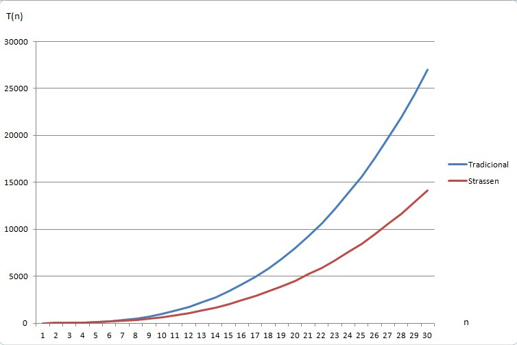
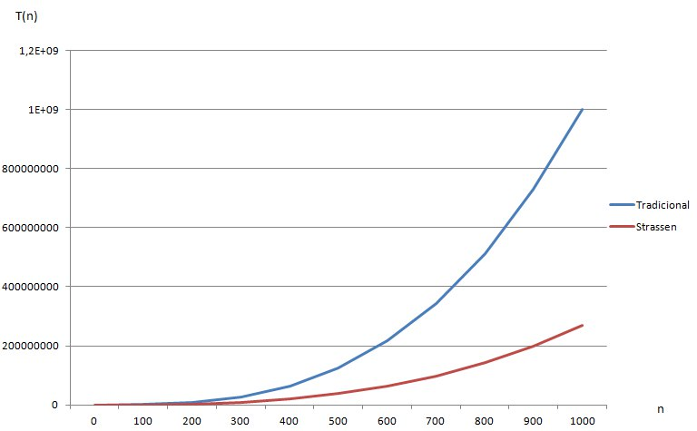

## Comparativa Gráfica

### Poca diferencia con entrada pequeña

Si hacemos un estudio del algoritmo de Strassen a pequeña escala, apenas hay diferencia con respecto al producto de matrices con el algoritmo tradicional. Esto es debido a que la cota superior de ambos algoritmo es muy próxima (Θ($$ n^{2.81} $$) de Strassen por Θ($$ n^{3} $$) el tradicional). A continuación se muestra una gráfica donde se analiza el tiempo total para entradas en un rango de 1 a 30.

En cambio, dado que son complejidades exponenciales, cuanto más grande es la entrada del algoritmo, más aumenta la diferencia entre ambos. Esto es realmente la gran mejora en el algoritmo de Strassen ya que, en la realidad, se trabaja con matrices muy grandes cuyos productos se simplifican mucho en tiempo con el dicho algoritmo. El tratamiento de imágenes es un claro ejemplo donde se podría aplicar esta mejora. 

El mismo ejemplo anterior, con los dos algoritmos, lo hemos aplicado ahora con entrada de 0 a 1000, ampliando 100 en cada punto. Aquí ya se puede apreciar como aumenta la diferencia entre ambos algortimos, siendo mucho más eficiente el de Strassen, que en el punto de entrada n = 1000 ya es **casi 4 veces** más rápido que el tradicional.

