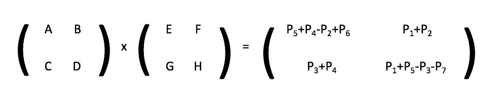
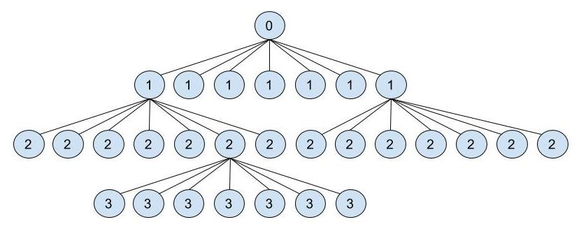

## EXPLICACIÓN DEL ALGORITMO

### Diferencias con el algoritmo recursivo básico

El algoritmo de Strassen mejora tan sólo levemente la complejidad del primer algoritmo recursivo para multiplicación de matrices. La combinación de las sub-soluciones las lleva a cabo de exactamente igual forma, y ya veremos que en esencia lleva a cabo exactamente el mismo procedimiento a la hora de hallar las soluciones de cada uno de los subproblemas en cada nivel de recursividad. La clave reside en que Strassen se las arregló para tener que llevar a cabo tan solo siete productos de matrices para resolver cada subproblema, mientras que el primer algoritmo recursivo debía realizar ocho productos.

Veamos primero el procedimiento de multiplicación:



Como vemos, entran en juego unas matrices $$ P_{1-7} $$ que no habíamos visto hasta ahora. En principio, la definición de estas matrices implica cada una un producto de submatrices desde la A hasta la H.

	P1 = A * (F - H)
	P2 = (A + B) * H
	P3 = (C + D) * E
	P4 = D * (G - E)
	P5 = (A + D) * (E + H)
	P6 = (B - D) * (G + H)
	P7 = (A - C) * (E + F)

Aquí tenemos los siete productos que realiza el algoritmo de Strassen para resolver cada subproblema. La pregunta ahora está en su procedencia. Lo cierto es que esta no es para nada trivial, pero efectivamente, si llevamos a cabo las sustituciones pertinentes, veremos cómo la secuencia de sumas y restas que se llevan a cabo con las submatrices $$ P_{1-7} $$ equivale a las distintas sumas de productos que utilizaba el primer algoritmo recursivo. Veamos un ejemplo:

$$ P_5 + P_4 - P_2 + P_6 = (A + D) * (E + H) + D * (G - E) - H * (A + B) + (B - D) * (G + H) = $$

$$ AE + AH + DE + DH + DG - DE - HA - HB + BG - BH - DG - DH = AE + BG $$

Como podemos ver, el producto de sumas que el primer algoritmo recursivo coloca en el cuadrante superior izquierdo de la matriz resultado, tiene exactamente el mismo valor que la operación con las matrices $$ P_i $$. Y si llevamos a cabo la comprobación para los otros tres cuadrantes, veríamos que también son equivalentes. 

---

### Pseudocódigo

```
Strassen (MA, MB)

    ad_hoc
        // Dividimos las matrices MA y MB en cuatro componentes cada una
        // Genera los números A(MA11), B(MA12), C(MA21), D(MA22), E(MB11), F(MB12), G(MB21) y H(MB22)
        P1 = A * (F - H)
        P2 = (A + B) * H
        P3 = (C + D) * E
        P4 = D * (G - E)
        P5 = (A + D) * (E + H)
        P6 = (B - D) * (G + H)
        P7 = (A - C) * (E + F)

        // Creamos los cuatro elementos de la solución
        R11 = P5 + P4 - P2 + P6
        R12 = P1 + P2
        R21 = P3 + P4
        R22 = P1 + P5 - P3 - P7

        R = fusion(R11, R12, R21, R22);
        return R;

    else
        // Dividimos las matrices MA y MB en cuatro cuadrantes cada una
        // Se generan las submatrices A, B, C, D, E, F, G y H

        P1 = Strassen(A, (F - H));
        P2 = Strassen((A + B), H);
        P3 = Strassen((C + D), E);
        P4 = Strassen(D, (G - E));
        P5 = Strassen((A + D), (E + H));
        P6 = Strassen((B - D), (G + H));
        P7 = Strassen((A - C), (E + F));

        // Creamos los cuatro elementos de la solución
        R11 = P5 + P4 - P2 + P6
        R12 = P1 + P2
        R21 = P3 + P4
        R22 = P1 + P5 - P3 - P7

        R = fusion(R11, R12, R21, R22);
        return R;
    
```
---

### Recurrencia

A continuación, vamos a analizar el algoritmo de Strassen para averiguar exactamente en qué medida mejora al algoritmo tradicional y al primer algoritmo recursivo. Comenzando con la recurrencia, sabemos que, para cada problema, debemos llevar a cabo siete productos. Es decir, que de cada problema, van a surgir siempre ocho subproblemas. El tiempo necesario para "generar" estos subproblemas, es decir, para dividir las matrices, lo consideraremos constante (Θ(1)). 

Nos queda saber el tiempo necesario para fusionar las soluciones parciales (submatrices) para generar una solución mayor. Si consultamos el pseudocódigo, veremos cómo el procedimiento fusionar es fundamental en este algoritmo, como ya lo era en el primer algoritmo recursivo. Puesto que el procedimiento aquí es exactamente el mismo que entonces, su complejidad sigue siendo proporcional al número de entradas de la matriz, es decir, (Θ($$ n^2 $$)).

Sabiendo todo esto, y que los casos base tratan simplemente de multiplicar, sumar y restar números, y no matrices, podemos formar la fórmula de recurrencia del algoritmo de Strassen:

* Número de subproblemas por cada problema: **a = 7**.
* Tamaño de cada subproblema: **b = n/2**.
* Tiempo invertido en dividir las matrices: **D(n) = Θ(1)**. Esto es despreciable frente a C(n).
* Tiempo invertido en fusionar las submatrices: **C(n) = Θ($$ n^2 $$)**.

``` 
T(n) = Θ(1) 						si n = 1
T(n) = 7T(n/2) + Θ(n^2)			en el resto 
```

Por el método maestro, podríamos concluir de inmediato que la complejidad de este algoritmo es subcúbica. El valor de a (7) es mayor que el valor de $$ b^d (2^2 = 4) $$, y por tanto estamos ante el tercer caso que contempla el método maestro. La complejidad de este algoritmo es Θ($$ n^{log_27} $$). Puesto que el valor del $$ log_27 $$ está entre 2.80 y 2.81, concluimos que la complejidad es Θ($$ n^{2.81} $$).

---

### Análisis mediante el árbol de recursividad

La demostración del método maestro es bastante compleja y daría para un documento aparte. Además, se trata de una regla muy general. Lo que vamos a hacer es deducir la complejidad que concluimos mediante el método maestro, utilizando la técnica del árbol de recursividad, muy común a la hora de determinar la complejidad de algoritmos Divide y Vencerás.

El árbol de recursividad sería el siguiente:



El árbol al completo sería demasiado grande incluso para solo cuatro niveles, así que lo hemos dibujado parcialmente. Como vemos, efectivamente de cada subproblema surgen siete nuevos subproblemas, y así sucesivamente hasta llegar al caso base. Vemos el nivel 0, nivel 1, nivel 2, nivel 3...

* El número de subproblemas en cada nivel es de $$ 7^i $$, siendo i el número del nivel.
* Si el tamaño de cada subproblema siempre es el tamaño del problema del que procede dividido a la mitad, entonces podemos decir que un subproblema tiene un tamaño igual a $$ \frac{n}{2^i} $$.
* Entonces, el tamaño total de cada nivel es igual a $$ 7^i * \frac{n}{2^i} $$.

Ahora necesitamos saber cuántos niveles hay exactamente. Sabemos que el último nivel, el caso base, tiene tamaño n = 1. Por tanto, podemos despejar i de la ecuación $$ 7^i * \frac{n}{2^i} = 1 $$, obteniendo que i es igual a $$ log_2n $$. Puesto que el primer nivel de todos es el nivel 0, tenemos en total $$ log_2n + 1 $$ niveles. 

Conociendo el tamaño de cada nivel y sabiendo el número de niveles que hay, podemos realizar la siguiente progresión geométrica para obtener finalmente el tamaño total del problema:

$$ \sum_{i=0}^{log_2n} (\frac{7^i}{2^i})n = \sum_{i=0}^{log_2n-1} (\frac{7^i}{2^i})n + n^{log_27} $$

$$ n\sum_{i=0}^{log_2n} (\frac{7^i}{2^i}) + n^{log_27} = n * k + n^{log_27} $$

$$ T(n) = n * k + n^{log_27} => T(n) = Θ(n^{log_27}) $$

A continuación, lo que vamos a hacer es ejecutar el algoritmo de Strassen y el algoritmo tradicional múltiples veces, comparando los resultados con los esperados según la complejidad que hemos concluido que tiene cada uno. Efectivamente, hemos implementado ambos algoritmos utilizando el lenguaje de programación Java, así como dos programas que los ponen a prueba y nos indican el número de pasos que se han tenido que llevar a cabo. Se puede consultar el código [aquí](https://github.com/alu0100881677/Strassen/tree/master/Code).

---
